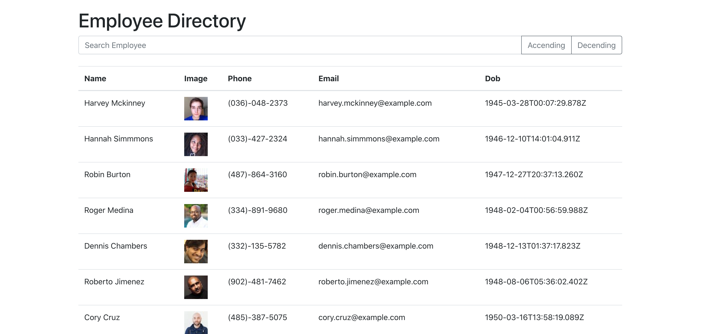

# 19 Employee Directory
## Description
Search and filter through an employee directory. Build using react and bootstrap
## Links
* [Web App](https://ma-employee-directory.herokuapp.com)
* [Github Repo](https://github.com/magedabdelsalam/employee-directory)
## Table Of Contents
* [Screenshot](#screenshot)
* [Installation](#installation)
* [Usage](#usage)
* [Contributing](#contributing)
* [Credits](#credits)
* [Questions](#questions)
* [License](#license)
## Screenshot

## Installation
1. Make sure you have nodejs and npm installed on your local machine
1. Clone this repo onto your local machine
2. Open your command line and cd to the cloned folder
3. Run `npm install` to install all dependences
4. Done! You're ready to use the app.
## Usage
`npm start`
## Credits
* Maged Abdelsalam
## Questions
* Email me at hello@magedabdelsalam.com
* [magedabdelsalam](https://github.com/magedabdelsalam)
## License

